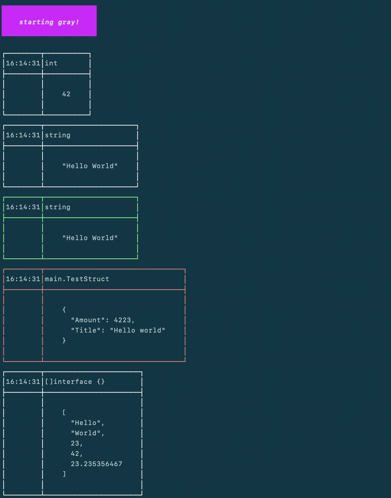

# Gray
Gray is a simple server that can receive messages from your project. It is useful for debugging and testing purposes.

## How to use?
Start the server.
```bash
go run main.go
```

Copy the gray folder into your porject. You may want to add it to your .gitignore to prevent it from being uploaded to your repository.

You can also use the following command to copy the gray folder into your project:
```bash
go run main.go copy PATH_TO_YOUR_PROJECT
```

To send something to the server, you can use the following code in your project:
```go

import gray

func main() {
    gray.Send("Hello, World!")
}

```

Some examples of what you can send to the server are located in the [examples/main.go](examples/main.go) folder. You can run them by using the following command:
```bash
go run examples/your_example.go
```

## Screenshot


## Credits
It is inspired by [Ray](https://myray.app/) from [Spatie](https://spatie.be/).

Used libraries:
- [https://github.com/charmbracelet/lipgloss](https://github.com/charmbracelet/lipgloss)
- [https://github.com/spf13/cobra](https://github.com/spf13/cobra)
